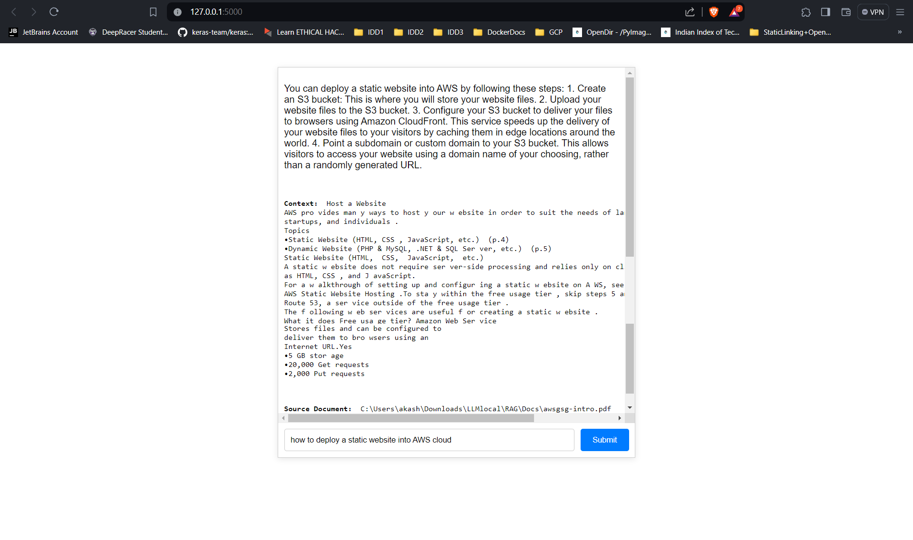

The repository shows an example of performing Retrieval Augmented Generation (RAG) on a Mistral-7B model using the Langchain Toolkit. While there are various ways to implement RAG, such as using Hugging Face or Haystack, I chose Langchain for its customization options and fine-tuning capabilities.

### Hugging Face Transformers:
**Pros:**
- Large community support and a wide range of pre-trained language models.
- Easy-to-use interfaces for working with state-of-the-art models.
- Provides a RAG model that combines retrieval and generation (RagTokenizer, RagRetriever, etc.).

**Cons:**
- Limited customization compared to building your own pipeline.

### Haystack:
**Pros:**
- Designed specifically for Question Answering (QA) systems with retrievers.
- Supports various retrieval models, including Elasticsearch, FAISS, and more.
- Can be integrated with different language models for generation.

**Cons:**
- Specific focus on QA systems, may require adaptation for broader applications.
- Learning curve for setting up and configuring the components.

### Langchain:
**Pros:**
- Specialized in combining language models and retrieval systems.
- Provides tools for building custom retrieval and generation pipelines.
- Allows fine-grained control over the components used in the system.

**Cons:**
- Smaller community compared to Hugging Face.
- May require more manual setup and configuration.

Sample output can be displayed as follows:

To customize parameters and facilitate easy retrieval of information from PDFs, I opted for Langchain. Another approach, a step closer to RAG, involves creating a vectorDB using FAISS and performing semantic search to find the closest matches. This can then be passed to a text generation model to provide more information about the similar found texts. An example of this approach can be found in [Semantic-Search-Engine-With-Summarizer](https://github.com/college-akashrai/SemanticSearchForPatents).

This code can be reproduced by cloning the directory and thus deleting the `stores` directory as it contains the embeddings created and also removing any documents in the `Docs` directory and you can insert your own documnets here. And using the command
`pip install -r requirements.txt` after creating a new environment using conda 

The `research` directory contains the code tests and how I'd first used Jupyter notebook to generate results in a different way and then transforming it to a python script. The templates dir has the `index.html` files where I'd tried different UI but as I'm not too good/experienced at it so I tried to stick with a basic template. Flask is used for backend integration of the HTML file and is available in `app.py`. 

But in order to create the vector store first we have to run the `ingest.py` file while placing the documents in the correct directory.
Finally, downloading any LLM model (P.S. here I've used Mistral7B) from HuggingFace onto your local machine and provide the path or you can just give the complete info of the model from HuggingFace like: `TheBloke/Mistral-7B-Instruct-v0.1-GGUF`

And thus it will download the model temporarily in cache and can be used repeatedly if loaded once. So running the python script using:
`python3 app.py` would spin off the flask server and the model will be loaded and thus using the chat UI we can give queries based on the docs and accurate responses with the sourcing of the info too. The chat interface wasn't developed too well due to some time constraints and my lack of in-depth frontend knowledge. But I beleive learning frontend won't be a major part here as I was easily able to create endpoints and perform the app to run without major issues. 

